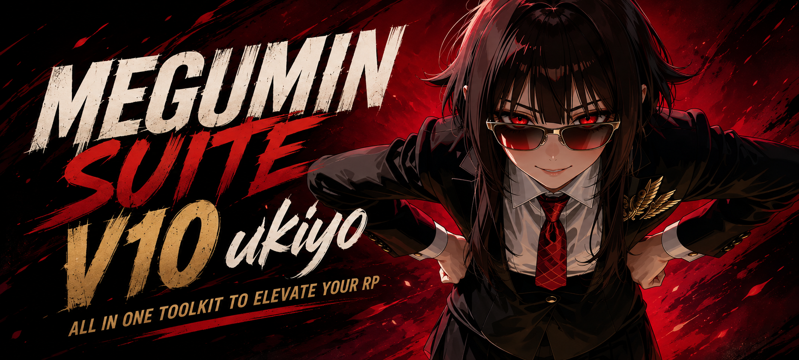
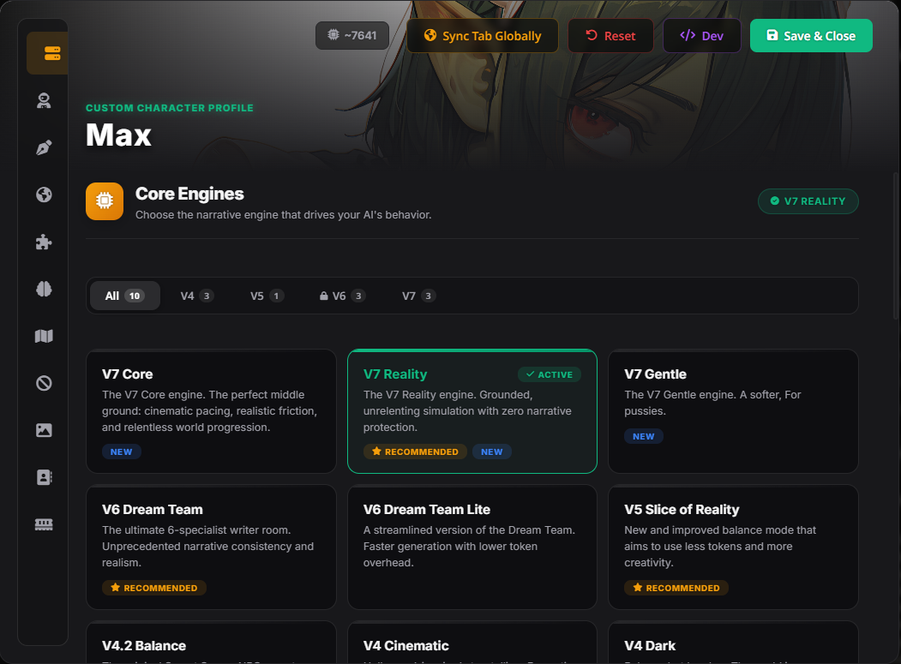
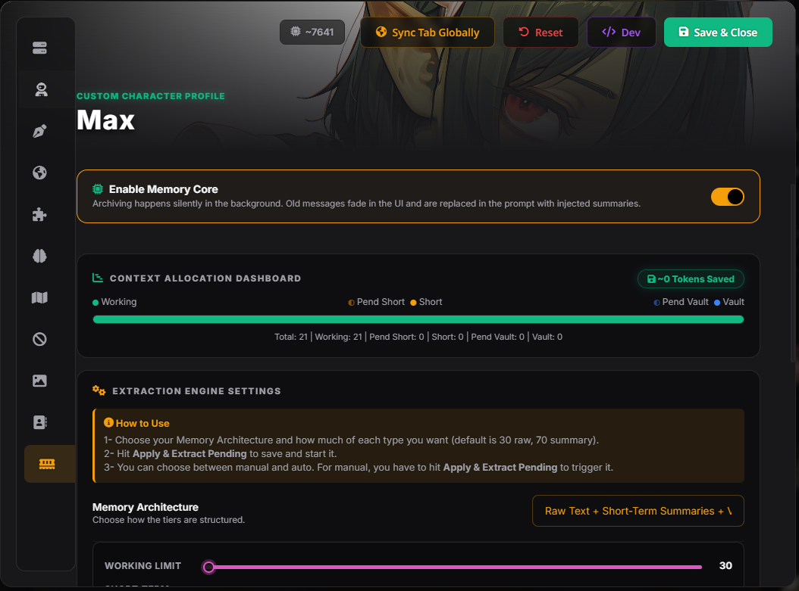
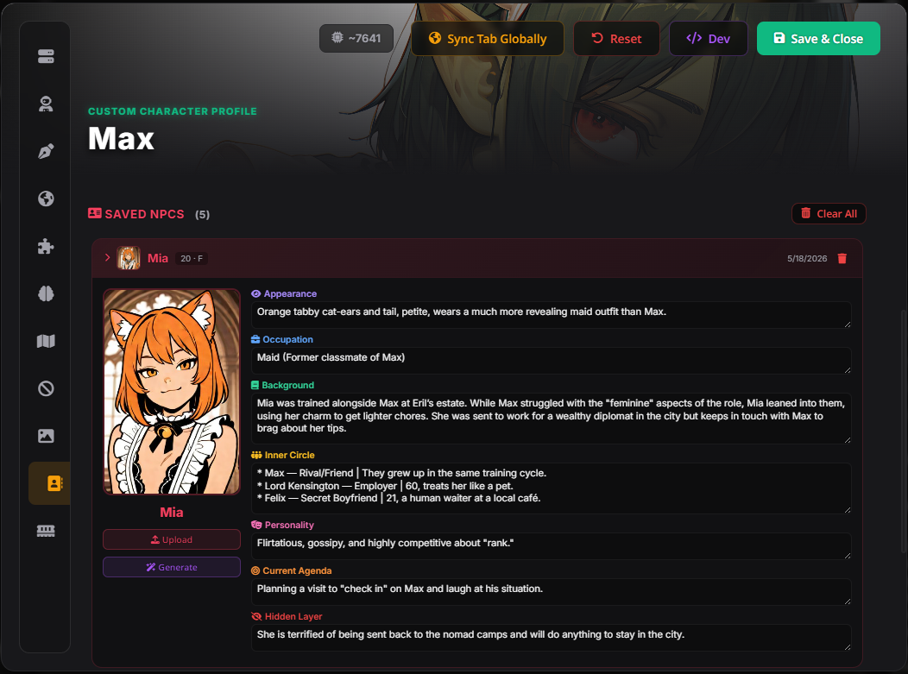
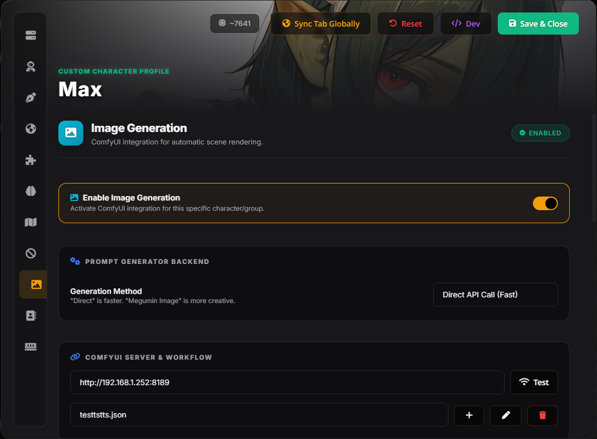

<div align="center">

<!-- Replace with your actual banner image -->


[](https://lumiverse.chat)
[](#)
[](https://creativecommons.org/licenses/by-nc-nd/4.0/)

> *"Everything your preset should have been: a real narrative engine, chain-of-thought reasoning, automated NPC tracking, and ComfyUI image generation in a single install."*

**Megumin Suite** is a full-stack overhaul to how Lumiverse presets work. It replaces your prompt engineering, your NPC management, and your image pipeline — all in one extension. V9 adds the **Mirage** engine family, the **Story Config** block, the **Blocks** envelope with per-block ordering, and V9 chain-of-thought frameworks.

[Features](#-core-features) • [Installation](#-installation) • [The V9 Engines](#-the-v9-engines) • [Image Gen](#-image-gen-kazuma)

</div>

---

## 🚀 What's New in V9?

V9 rebuilds the narrative engine around an authorial voice, adds standing story settings, and gives you direct control over what the model emits at the end of every reply.

*    **V9 CoT Frameworks:** Mirage, Lite, Director, Immersion and Hybrid reasoning sequences, each paired with its engine.
*    **Story Config:** Standing settings for a story — genre, tone, POV, pacing, difficulty, era, culture — compiled into a `<config>` block that overrides anything earlier in the prompt.
*    **Blocks Envelope:** Every tracker block emitted inside one `<Blocks>` section, in an order you choose, with Bonds and Character Sheet templates generated from your own field lists.
*    **Automated NPC Bank:** The AI detects new characters, writes dossiers on them, saves them, and injects them back into the prompt only when relevant. It even auto-generates ComfyUI portraits for them!
*    **Modular Engine Toggles:** Turn off specific engine behaviors (like Cultural Anchoring or OOC protocols) without breaking the core logic.

---

## 🌟 Core Features

###  The V9 Engines
Choose the core ruleset that drives your world's logic and tone.
*   **V9 Mirage:** The flagship. Writes as the author of the world — every NPC, every passing minute — and commits to one emotional temperature per scene.
*   **V9 Lite:** The same discipline with noticeably less token overhead.
*   **V9 Director:** Scene staging and pacing take priority. Best when you want the story pushed forward.
*   **V9 Immersion:** The deepest sequence. Heaviest world-state and continuity checking before it writes.

The V8, V7 and V6 engine families are still included and fully supported.

###  Story Config
Standing settings for a story, compiled into a `<config>` block that overrides anything earlier in the prompt.
*   **16 fields:** genre, culture, era, POV, focus, tone, narrator presence, NPC speech style and disposition, pacing, difficulty, friction, explicitness, length, and free-form notes.
*   **Blank means Default:** an empty field emits no line at all, so the engine keeps its own judgement for it.
*   **Starter presets:** Grimdark Survival, Cozy Slice of Life, Noir Mystery, Slow Dread Horror, Slow Burn Romance.

###  Blocks Envelope
Everything the model emits at the end of a reply, inside one `<Blocks>` section.
*   **You choose the order:** the stack is membership and sequence both — a block that is not in it is never emitted.
*   **Generated templates:** Bonds and Character Sheet are built from your own field lists, so adding a field changes what the model is asked for.
*   **Custom blocks:** define your own tag and body.
*   **Compact World State:** a short block most turns and the full one every Nth reply.

###  Automated NPC Bank
A persistent character database that tracks every NPC accurately across sessions.
*   **Auto-Extraction:** When a significant NPC is introduced, the AI writes a "dossier" (Name, Appearance, Inner Circle, Hidden Layers, Agenda) and saves it to the bank.
*   **Dynamic Injection:** Scans your last 4 messages and injects relevant NPC dossiers into the prompt so the AI remembers them accurately.
*   **AI Portrait Studio:** Click a button to have ComfyUI automatically generate a character portrait based purely on the AI's physical description of them.

###  Advanced Chain of Thought (CoT)
Control the AI's internal reasoning process before it outputs text.
*   **The 5-Phase Audit:** *Ground Truth ➔ Plot Engine ➔ Scene Design ➔ Active Draft ➔ Correction Loop*.
*   **Knowledge Firewall:** Forces the AI to trace *how* an NPC knows something, preventing them from mind-reading the user's internal narration.
*   **Gemini Thinking:** A special toggle that injects triple `<think>` tags to bypass Google's strict reasoning refusal filters.
> ⚠️ **Note:** if you enable Gemini Thinking navigate to 'AI Response Formatting', 'Reasoning', activate 'Auto-Parse', and set the Prefix to `<think>` and Suffix to `</think>`.

###  Image Gen Kazuma (ComfyUI)
Seamlessly wire up your local ComfyUI server to generate images while you play.
*   **Auto-Trigger:** The AI decides when a moment is "picture-worthy" and outputs a hidden image tag, triggering ComfyUI in the background.
*   **Overswipe Regeneration:** Simply swipe right on the last image in a gallery to instantly regenerate the prompt.
*   **LoRA Lab & Parameters:** Full control over Steps, CFG, Denoise, and 4 LoRA slots directly inside Lumiverse.

###  Dynamic Ban List (AI Slop Detector)
Tired of the AI saying *"a shiver ran down your spine"* or *"testament to..."*?
*   Click **Analyze Chat** to have the AI scan your last 50 messages and identify the top 5 repetitive crutch phrases it's using.
*   Automatically converts them into strict negative rules and bans them from future generations.

###  Story Planner &  Blocks
*   **Story Planner:** Brainstorms and tracks 10+ future plot milestones in the background.
*   **World State Tracker:** Injects a collapsible dashboard tracking the date, weather, PC's physical state, and NPC agendas.
*   **NPC Inner Chatter:** Forces the AI to output a hidden block of dialogue showing what the NPCs are *actually* thinking behind their masks.

---

## ⚙️ Installation

1. Open Lumiverse.
2. Go to the **Extensions** tab (the puzzle icon).
3. Click **Add Extension**.
4. Paste the repository URL:
   ```text
   https://github.com/Arif-salah/Megumin-Suite-Lumiverse
   ```
5. Download the Lumiverse preset JSONs files from this repo: https://github.com/Arif-salah/Megumin-Suite-Lumiverse/tree/main/Presets
> ⚠️ **Note:** If you download these on your phone and your browser renames them to `.json.txt`, you **must** use a file manager to rename them and delete the `.txt` part. Furthermore, make sure the Engine file is named EXACTLY `Megumin Engine.json` before you import it. The Suite file's name doesn't matter, but the Engine must be exact.
6. Open Lumiverse, go to the **Loom** tab.
7. Click the **Import Loom** button (the 3 stacked dots) and upload the json files.
8. Once imported, open your preset dropdown and **make sure "Megumin Suite" is the active preset.** The extension handles the Engine silently in the background.


~~or just watch the **Install video:** [youtube Video](https://www.youtube.com/watch?v=Q-iaz9mBFrA)~~ 


> **💡 Pro Tip:** Megumin Suite V9.1 Universal is the current preset and works across models.
if you have model not here just try.

> ⚠️ **Important:** Megumin Suite uses several **Regex scripts** that clean and format messages before they're sent to the AI. After importing them into Lumiverse, go to the **Regex** tab and **make sure all Megumin-related regex entries are enabled**.

---

## 🕹️ Quick Start Guide

<div align="center">
  
  
  
  
</div>

1. **Select an Engine:** Open the Megumin Suite menu (wand icon) and pick a Core Engine (e.g., **V9 Mirage**).
2. **Set your Style:** Go to the Writing Style tab. Choose a precooked style like *Sensory-Rich* or use the AI to generate a custom one.
3. **Enable CoT:** Go to the Chain of Thought tab and select **CoT V9 (Mirage)** to match the engine.
4. **Set up Story Config (Optional):** Open the Story Config tab, switch it on, and set genre, tone and pacing — or load a starter preset.
5. **Chat!** The extension handles all prompt injection and formatting silently in the background.

> **💡 Pro Tip:** If you want to see exactly what Megumin Suite is sending to the AI under the hood, enable **Prompt Payload Preview** in the Global Settings tab.

---

## 🛠️ Troubleshooting & Tips


*   **LLMs:** Designed for highly capable instruction-following models (Claude 4.6 Sonnet/Opus, DeepSeek v4, Gemini 3.1 pro/flash, GLM 5.1). Smaller local models may struggle with the strict V9 CoT instructions.
*  **Does this extension mess with my other presets?** No — your other presets will work just fine. Megumin Suite only injects its rules into its own designated preset (Megumin Suite). Your existing presets remain completely untouched.
* **Old Versions:** Legacy docs are here: [Megumin Suite v4 Legacy Readme](https://github.com/Arif-salah/Megumin-Suite/tree/V4.1)  [Megumin Suite v5 Legacy Readme](https://github.com/Arif-salah/Megumin-Suite/tree/V5) [Megumin Suite v6 Legacy Readme](https://github.com/Arif-salah/Megumin-Suite/tree/V6)

---

## 🤝 Credits & Acknowledgements

*   Built natively for [Lumiverse](https://lumiverse.chat).
*   MVU Compatibility integration inspired by [KritBlade's MVU Game Maker](https://github.com/KritBlade/MVU_Game_Maker).

---

<div align="center">

### 💜 Support the Project

Megumin Suite is free and always will be. If it saved you hours of prompt engineering or made your sessions better, consider tossing a few bucks it keeps development alive and the updates coming.

🪙 **Crypto (LTC):** `LSjf1DczHxs3GEbkoMmi1UWH2GikmXDtis`

⭐ *Not in a position to donate? Starring the repo and sharing it helps just as much.*

</div>
